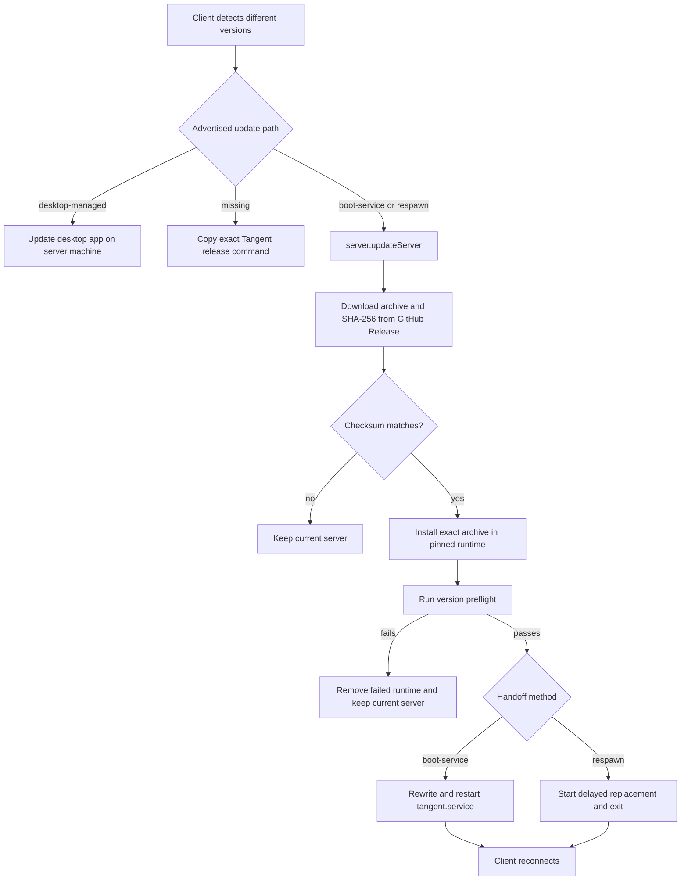

# Server Update Architecture

Tangent can update a connected server to the exact version of the client that detected version
drift. This primarily serves remote environments where the user may not have a terminal open.

The feature has three boundaries:

- the server advertises whether and how it can be replaced;
- the client chooses the matching user action;
- the server verifies a Tangent GitHub Release artifact before handing off the process.

## Detection and Presentation

`ExecutionEnvironmentDescriptor` includes the server version and an optional
`capabilities.serverSelfUpdate` value. A missing value is backward compatible with older servers
and results in an exact manual relaunch command.

The shared `ServerUpdateAction` appears in:

- the conversation banner in `ChatView`;
- primary and saved environment rows in **Settings** → **Connections**.

Both surfaces target the client's exact version. The mismatch disappears when the reconnected
server reports that version.

## Capability Selection

| Advertised value  | Process shape                                                                              | Client behavior                                                |
| ----------------- | ------------------------------------------------------------------------------------------ | -------------------------------------------------------------- |
| `boot-service`    | Linux server running under the Tangent-managed `tangent.service` systemd user unit         | Call the update RPC; replace and restart the unit.             |
| `respawn`         | Packaged Tangent CLI running in the foreground on macOS or Linux                           | Call the update RPC; hand off to a detached replacement.       |
| `desktop-managed` | Backend supervised by the Tangent desktop app                                              | Tell the user to update the desktop app on the server machine. |
| absent            | Older server, development checkout, Windows foreground process, or unrecognized supervisor | Offer an exact Tangent GitHub Release relaunch command.        |

Desktop ownership takes precedence over process-shape detection. A desktop-managed backend must
not start a second CLI server beside the app-owned process. A process launched by an unrecognized
systemd unit also avoids foreground respawn because its supervisor could bring the old version
back.

## Update Flow

`server.updateServer` requires the environment's `orchestration:operate` authorization scope and
accepts only an exact version. Floating labels are rejected.

For version `X.Y.Z`, the downloader resolves:

- tag `personal-vX.Y.Z`;
- archive `tangent-server-X.Y.Z.tgz`;
- checksum `tangent-server-X.Y.Z.tgz.sha256`;
- repository `bpdev97/tangent`.

The checksum is downloaded separately, parsed for the exact archive name, and compared with the
archive's computed SHA-256 before any package installation. The verified archive is saved under
`<baseDir>/runtime/downloads`.

The package is installed under `<baseDir>/runtime/versions/<version>`. Its completion sentinel
contains the GitHub tag and artifact hash, not merely the version, so a runtime previously installed
from a different source cannot be reused. Boot-service setup and self-update share a process-wide
installation lock.

Before restart, the current Node executable runs the replacement with `--version`. A failed
download, checksum, install, preflight, or wrong reported version leaves the current server alive.

## Host Service Lifecycle

The standalone `t3 service install`, `uninstall`, `update`, and `status` commands own the systemd
user service. The executable name remains `t3` for compatibility, while production Tangent
installations come from the matching GitHub Release archive.

If onboarding itself is running from an ephemeral `npx` cache, service installation pins the exact
currently running package directory. It does not resolve `t3@<version>` from npm. The installed unit
is `tangent.service` and carries an explicit ownership marker used by self-update capability
detection.

The `t3 connect` onboarding flow may offer service installation through the same reconciliation
operation. Connect logout does not uninstall the host service.

## Process Handoff

For `boot-service`, the server atomically rewrites `tangent.service` to the verified runtime,
reloads systemd, and restarts it. Reload and restart failures restore the previous unit.

For `respawn`, the server starts a detached, delayed replacement with the original CLI arguments,
acknowledges the request, then schedules the old process to exit. The delay lets the acknowledgement
cross direct or relayed connections before the socket closes.

There is no separate progress stream. The request remains pending during download and installation,
and the client keeps the update action disabled through restart/reconnect with a safety timeout.

## Release Invariant

Every Tangent client version exposed to users must have its matching archive and checksum in the
same `personal-vX.Y.Z` GitHub Release. The personal release workflow builds the server package
before publishing the release, so desktop and server assets become visible atomically. npm
publication is not part of the Tangent self-update chain.

## Source Map

- Release naming: `downstream/config.ts`
- Shared release URL resolver: `packages/shared/src/serverRelease.ts`
- Download and checksum verification: `apps/server/src/cloud/serverRelease.ts`
- Capability detection and handoff: `apps/server/src/cloud/selfUpdate.ts`
- Host service commands: `apps/server/src/cli/service.ts`
- Pinned runtime installation: `apps/server/src/cloud/pinnedRuntime.ts`
- Client version comparison: `apps/web/src/versionSkew.ts`
- Shared update action: `apps/web/src/components/ServerUpdateAction.tsx`
