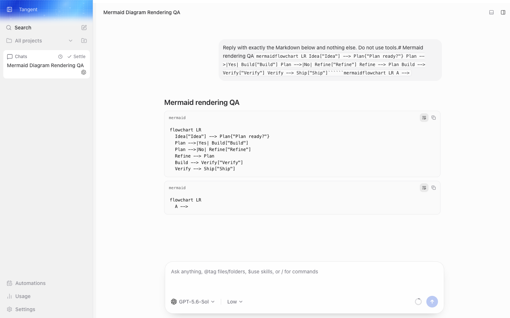
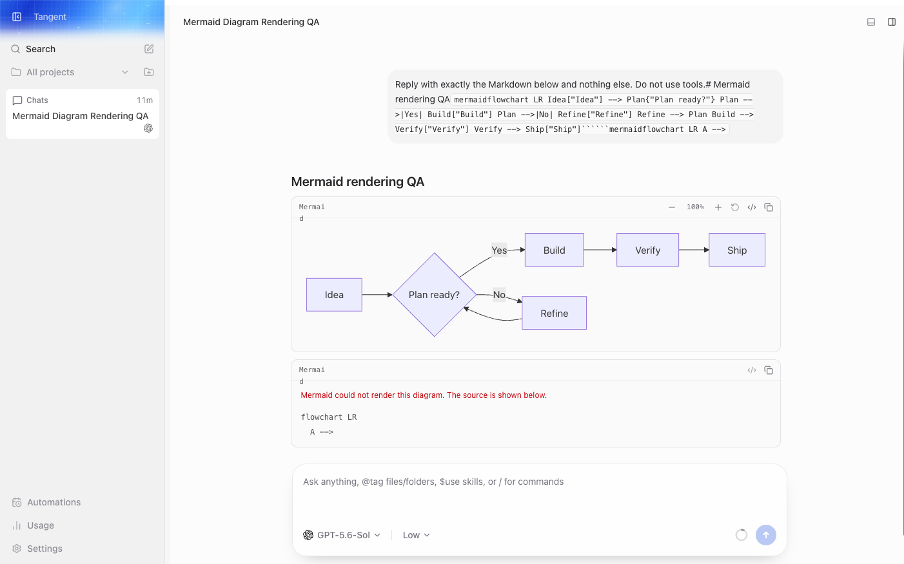

# FORK-MERMAID-001: Mermaid diagrams

This feature renders completed fenced `mermaid` blocks in the shared web Markdown view. The desktop
client inherits that view; the server, transport, providers, and mobile client remain unchanged.

## Architecture

`ChatMarkdown` has one Mermaid-specific decision at its existing fenced-code boundary. A completed
Mermaid fence is handed to the dedicated diagram component. Every other fence continues through the
upstream code-block and syntax-highlighting path, including Mermaid source while a turn is
streaming.

The component dynamically imports Mermaid only when a diagram is present. Mermaid's configuration
is process-global, so a module-level promise queue serializes initialization and rendering. Each
queued render selects Mermaid's built-in light or dark theme. A rejection is contained to that
diagram and does not poison later work in the queue.

The rendered SVG stays inline so colors and text remain crisp at any scale. The viewport uses native
scrolling for panning and a bounded local scale for zooming. There is no application setting,
diagram cache, pan/zoom dependency, or server-side rendering pipeline.

## Security and failure behavior

Mermaid is initialized with strict security and explicit text and edge limits. The component does
not call Mermaid's returned interaction binder, so generated callbacks and links are inert. The
source is the fallback before rendering and after any import, parse, or render failure.

Do not weaken strict mode or enable HTML labels to improve compatibility with an individual
diagram. Any broader content policy needs a separate security review.

## Performance boundary

Streaming messages remain source code. This avoids importing Mermaid or parsing incomplete syntax
on every token update. The dependency is split from the main web bundle by dynamic import, and only
pages that encounter a completed Mermaid fence load it. Rendering is deliberately uncached: this
keeps generated SVG identifiers scoped to one live component and avoids a second invalidation model
for theme and source changes.

## Expected presentation

The same completed response renders as ordinary fenced source without this fork feature and as an
interactive diagram with it. Invalid syntax remains visible as source instead of disappearing.

| Before                                                               | After                                                                                                       |
| -------------------------------------------------------------------- | ----------------------------------------------------------------------------------------------------------- |
|  |  |

## Upstream ownership

Upstream pull request [pingdotgg/t3code#4989](https://github.com/pingdotgg/t3code/pull/4989)
proposes related web support. Before syncing an upstream Mermaid implementation, compare its
streaming behavior, strict configuration, failure fallback, theming, and bundle-loading boundary.
Delete this fork component and registry entry when upstream owns equivalent behavior; do not run two
rendering paths.

## Verification

```sh
vp test apps/web/src/components/MermaidDiagram.test.tsx
vp check
vp run typecheck
```

Also complete one web smoke test in light and dark themes. Verify a valid flowchart, an invalid
diagram, source toggle and copy, zoom controls and scrolling, and source-only rendering during a
streaming turn. Desktop needs no separate rendering implementation, but the smoke test should
confirm its shared web view remains the only integration point.
