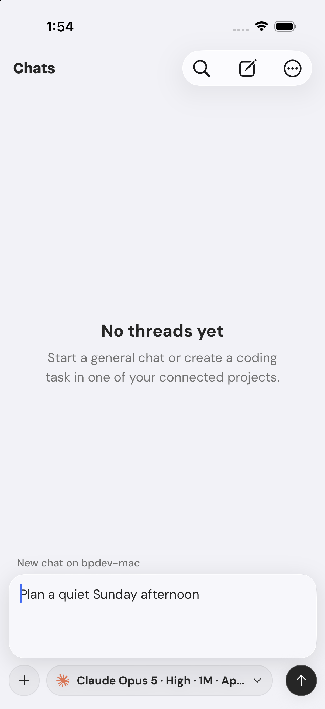
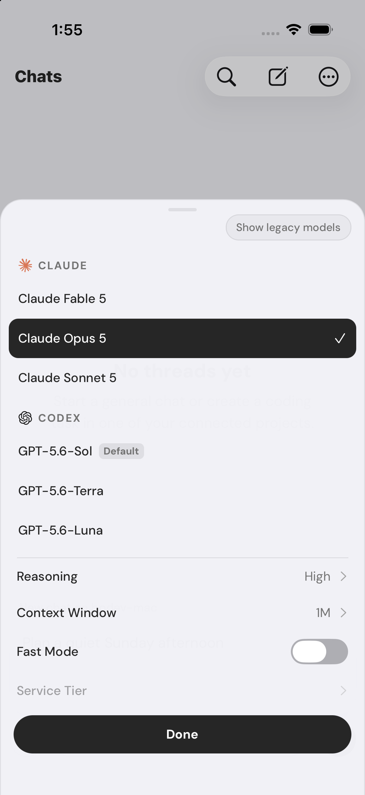
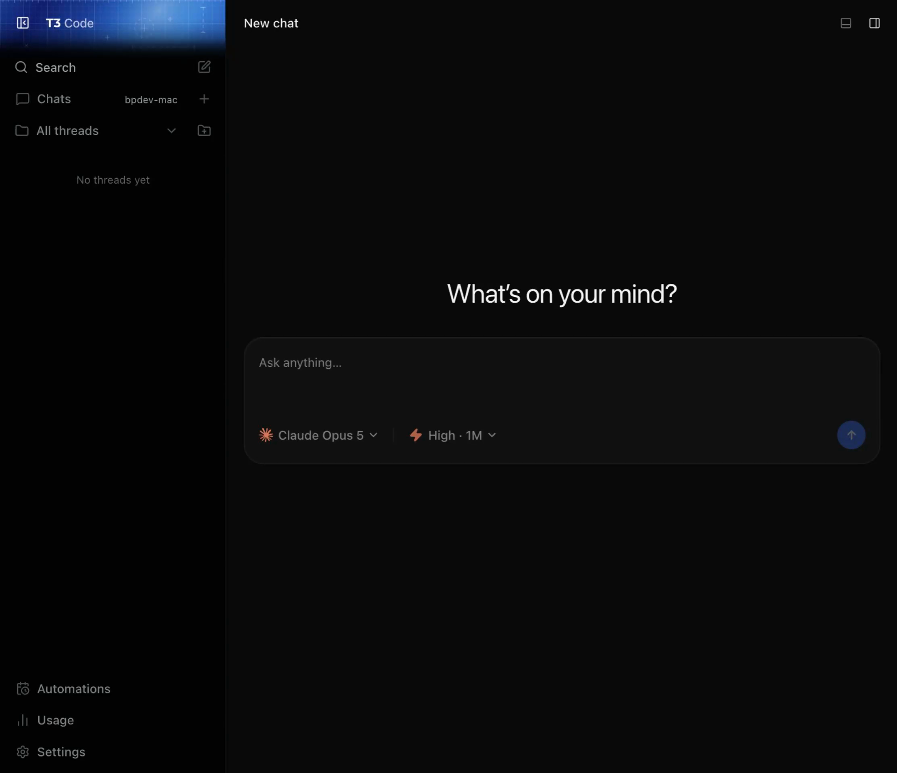

# Chats

Chats are conversations that are not attached to a repository. They use the same providers and
thread history as project work, while hiding project-only tools such as files, Git, worktrees, and
terminals.

Chats do not impose a separate provider tool policy. Providers use their normal profile, tools, and
approval behavior, while Tangent supplies only the fact that no project is attached and the process
working directory is app-owned scratch space. Chats remain in Supervised mode, so provider approval
requests still appear in the conversation.

Choose **Chat Host** in Settings to decide which environment starts every new chat. If that host is
unavailable, the draft remains on the device until the host returns; Tangent does not move it to a
different environment. Existing chats remain on the environment where they started.

On iPhone, tap **Ask anything** at the bottom of Home to slide up the full chat composer. Search,
New Thread, filters, and Settings are available from the top navigation bar. New Thread continues
to open the traditional project-based flow.

The chat composer uses the same provider, model, reasoning, attachment, draft, and offline-queue
behavior as the standard new-thread composer.

On iOS, the **New Chat** App Shortcut opens this composer from Shortcuts, Siri, Spotlight, and
compatible system controls. On iOS 26 and later, **Dictate New Chat** opens the composer and begins
voice input; review or edit the transcript before sending it. The shortcuts honor the selected
Chat Host, so a draft waits if that environment is unavailable.

On desktop, the Chats section shows the selected Chat Host without taking another row of sidebar
space.

## Raycast Quick Chat

The macOS app accepts the fixed action `bpdev-code-action://quick-chat`. A Raycast script command
can open that URL and own the global hotkey. Tangent decides what happens next:

- if the last viewed chat is still inside the resume window and has not been settled, it reopens it;
- otherwise it opens a fresh chat draft on the selected Chat Host;
- **Always start new** disables resuming.

Settled and archived chats never resume, even when they were viewed inside the window.

Configure the resume window under **Settings → General → Quick Chat**. This action does not change
normal Dock activation behavior.
