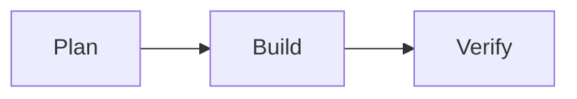

# Mermaid diagrams

Tangent renders fenced Mermaid code as diagrams in completed messages on the web and desktop
clients. Use a `mermaid` code fence in any Markdown response:

````markdown

````

The diagram follows the current light or dark theme. Its toolbar lets you zoom, reset the view,
switch between the diagram and its source, and copy the source. You can also focus the diagram and
press `+`, `-`, or `0`; hold Control or Command while scrolling to zoom. Ordinary scrolling pans a
diagram that is larger than its viewport.

While a response is streaming, Tangent shows the code fence instead of repeatedly rendering partial
syntax. If Mermaid cannot parse a completed block, the source remains visible and copyable with a
short error message.

Rendering happens locally in the client. Mermaid links, HTML labels, and interactive callbacks are
disabled.
